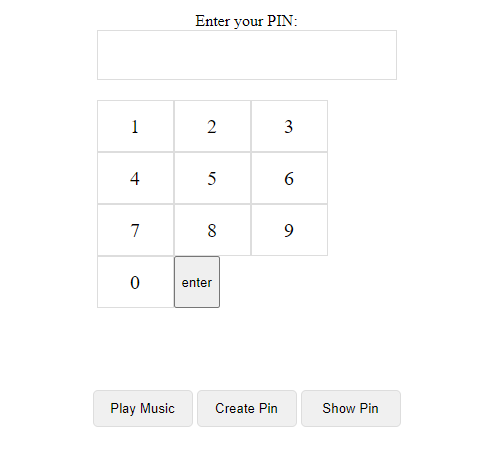

# EncryptionWithMusic

<h1> Hi Everyone 😊</h1>

<h2> In this project I tried to encrypt our passwords with music using javascript. </h2>

  

<h2> You create a password by pressing the create pin button
after than you have to enter the pin with piano notes. </h2>

<h2>Each number refers to a piano notes which are given in the audio file. </h2>

<h2>You can listen to the music revealed by the password you created by clicking the Play music button.</h2>

<h2>This project is just an example.</h2>

<h2>Feel free to use the code</h2>
